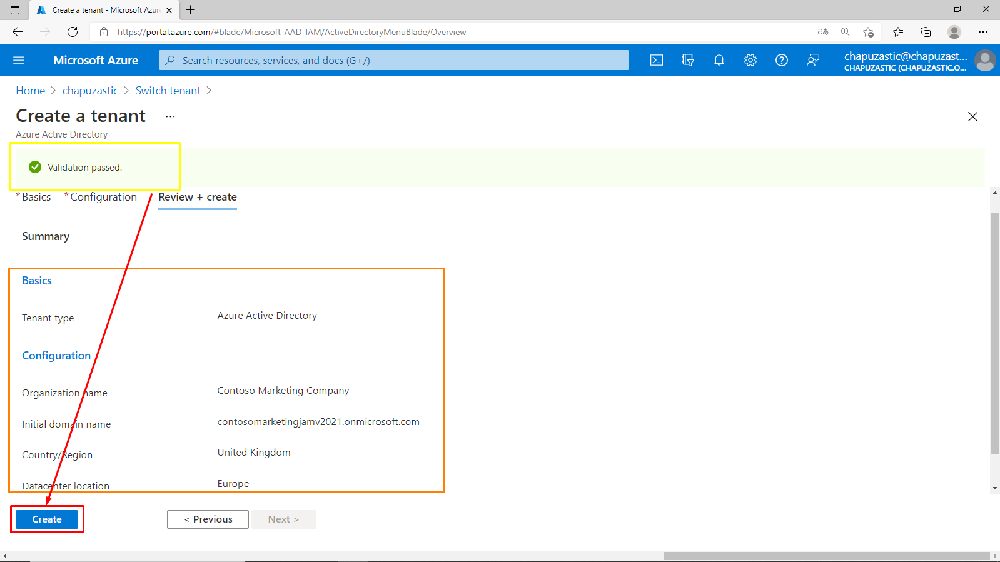
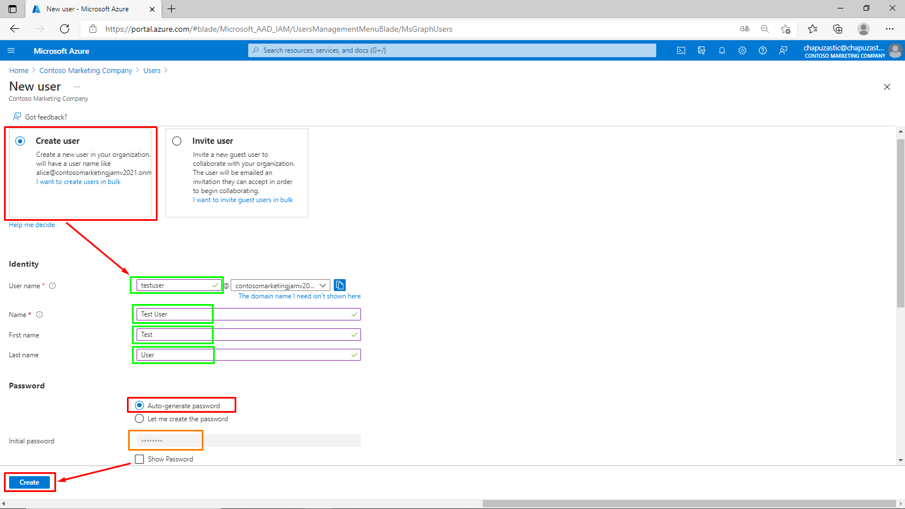
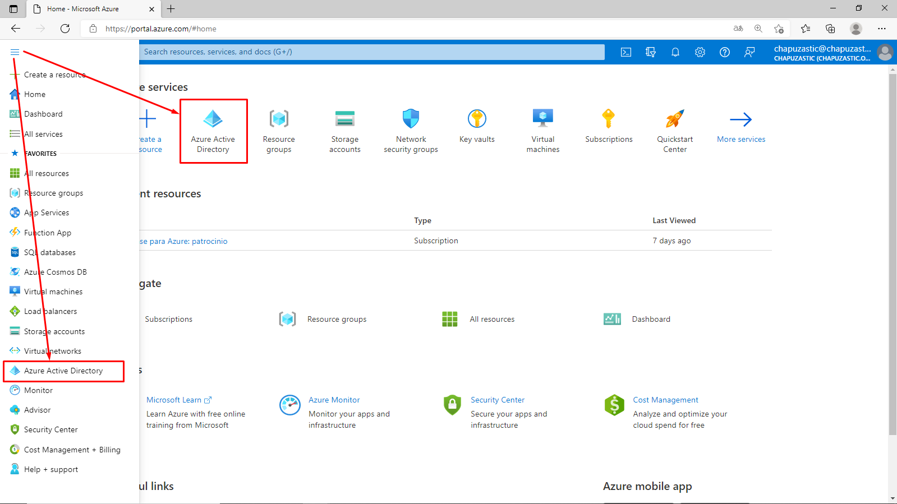

Student: José A. Montero

# Exercise 1: Registering an application in Azure Active Directory

## Task 1: Open the Azure portal

## Task 2: Create an Active Directory tenant

### Create an Azure AD organization

## Task 3: Create a user in new Active Directory tenant

## Task 4: Register an application

### Switch Azure AD Directory

### Register a new application

## Task 5: Branding of the application

