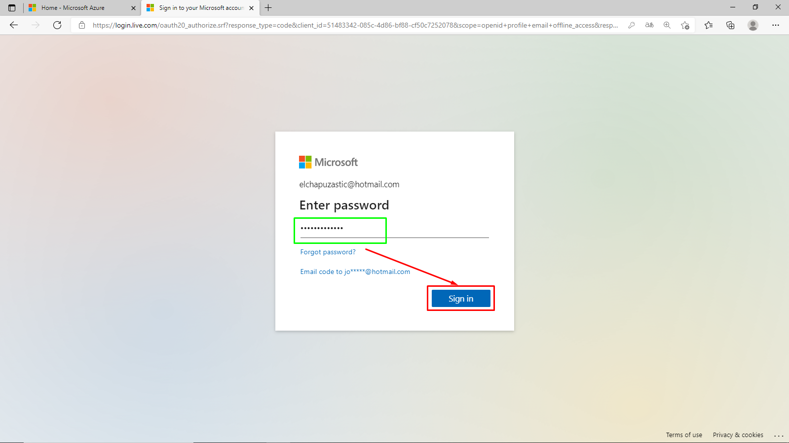
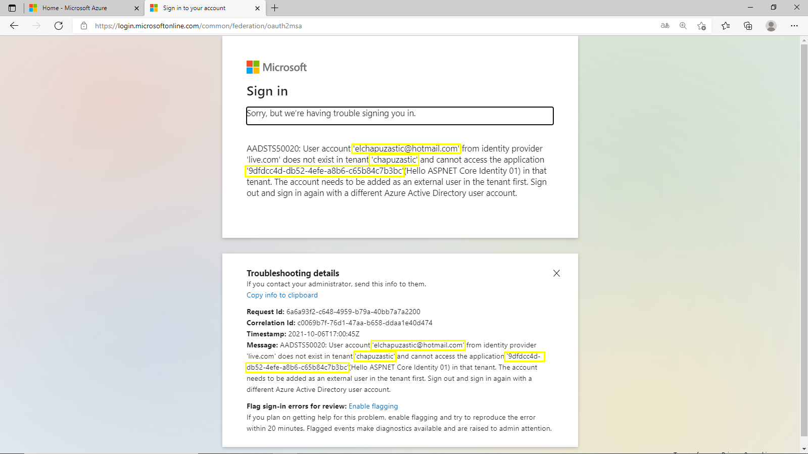

Student: José A. Montero

# Exercise 2: Implementing authentication

## Task 1: Create application that only allows single organization sign in

### Register a single-tenant Azure AD application

## Task 2: Create a single organization ASP.NET core web application

### Configure the web application with the Azure AD application you created

### Update the web application's launch configuration

### Update the user experience

## Task 3: Build and test the single organization web app

## Task 4: Create application that allows any organization's users to sign in

### Register a multi-tenant Azure AD application

